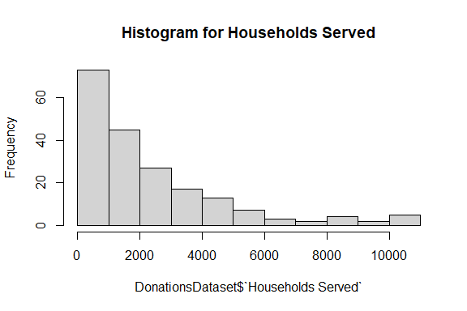
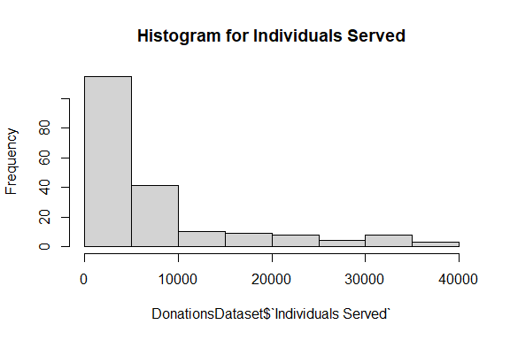
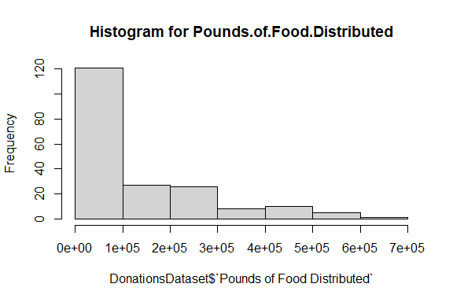
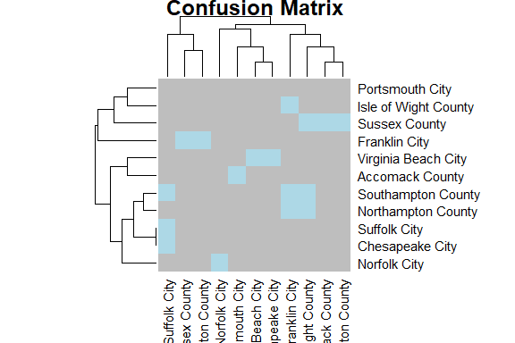
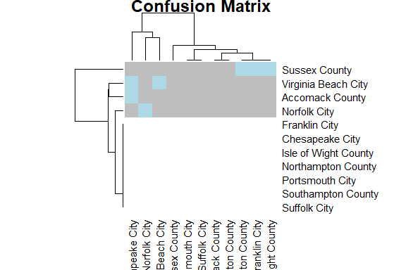
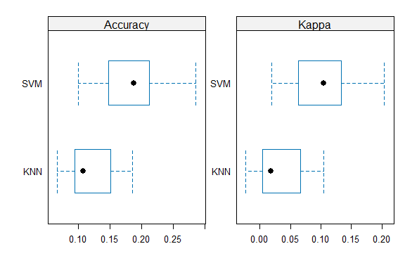
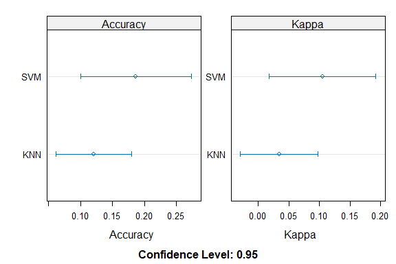
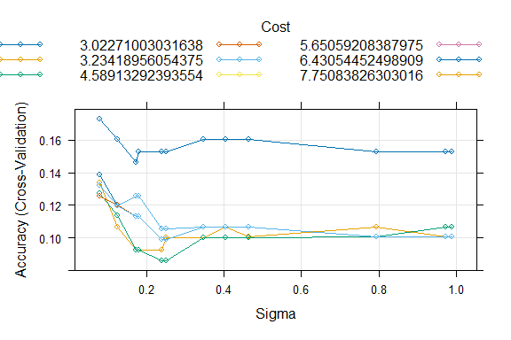

Business Intelligence Project Markdown
================
Kelly sota
27/11/23

- [Student Details](#student-details)
- [Setup Chunk](#setup-chunk)
  - [1: Install and Load Required
    Packages](#1-install-and-load-required-packages)
- [A. Milestone 1](#a-milestone-1)
  - [Issue 1: Descriptive Statistics](#issue-1-descriptive-statistics)
    - [2. Load the Dataset](#2-load-the-dataset)
    - [3. Measures of Frequency](#3-measures-of-frequency)
    - [4.Measures of Central Tendency](#4measures-of-central-tendency)
    - [5. Measures of Distribution](#5-measures-of-distribution)
  - [Issue 3 and 4: Basic Visualization and Preprocessing and Data
    Transformation](#issue-3-and-4-basic-visualization-and-preprocessing-and-data-transformation)
    - [6. Apply a Scale Data Transform](#6-apply-a-scale-data-transform)
  - [Issue 5. Training the Model](#issue-5-training-the-model)
    - [7. Splitting the Dataset](#7-splitting-the-dataset)
    - [8. Train the model](#8-train-the-model)
    - [9. Call the resamples Function](#9-call-the-resamples-function)
    - [10. Display the comparisons](#10-display-the-comparisons)
  - [Issue 6: Hyper-Parameter Tuning and
    Ensembles](#issue-6-hyper-parameter-tuning-and-ensembles)
    - [11. Random Search](#11-random-search)

# Student Details

|                                 |                                                              |
|---------------------------------|--------------------------------------------------------------|
| **Student ID Number and Name**  | 123324 - B - Kelly Noella Sota                               |
| **GitHub Classroom Group Name** | Lumin                                                        |
| **Course Code**                 | BBT4206                                                      |
| **Course Name**                 | Business Intelligence II                                     |
| **Program**                     | Bachelor of Business Information Technology                  |
| **Semester Duration**           | 21<sup>st</sup> August 2023 to 28<sup>th</sup> November 2023 |

# Setup Chunk

**Note:** the following “*KnitR*” options have been set as the
defaults:  
`knitr::opts_chunk$set(echo = TRUE, warning = FALSE, eval = TRUE, collapse = FALSE, tidy.opts = list(width.cutoff = 80), tidy = TRUE)`.

More KnitR options are documented here
<https://bookdown.org/yihui/rmarkdown-cookbook/chunk-options.html> and
here <https://yihui.org/knitr/options/>.

**Note:** the following “*R Markdown*” options have been set as the
defaults:

> output:  
>   
> github_document:  
> toc: yes  
> toc_depth: 4  
> fig_width: 6  
> fig_height: 4  
> df_print: default  
>   
> editor_options:  
> chunk_output_type: console

### 1: Install and Load Required Packages

In this step, we ensure that the necessary R packages are installed and
loaded. Packages are collections of R functions, data, and compiled code
that extend the functionality of R. The install.packages() function is
used to install packages, and library() is used to load them.

``` r
### Step 1: Load the required packages ---- languageserver ----
if (!is.element("languageserver", installed.packages()[, 1])) {
    install.packages("languageserver", dependencies = TRUE)
}
require("languageserver")
```

    ## Loading required package: languageserver

``` r
#### readxl ----

if (!is.element("readxl", installed.packages()[, 1])) {
    install.packages("readxl", dependencies = TRUE)
}
require("readxl")
```

    ## Loading required package: readxl

``` r
#### plumber ----
if (require("plumber")) {
    require("plumber")
} else {
    install.packages("plumber", dependencies = TRUE, repos = "https://cloud.r-project.org")
}
```

    ## Loading required package: plumber

``` r
#### e1071----

if (!is.element("e1071", installed.packages()[, 1])) {
    install.packages("e1071", dependencies = TRUE)
}
require("e1071")
```

    ## Loading required package: e1071

``` r
#### caretEnsemble ----

if (!is.element("caretEnsemble", installed.packages()[, 1])) {
    install.packages("caretEnsemble", dependencies = TRUE)
}
require("caretEnsemble")
```

    ## Loading required package: caretEnsemble

``` r
#### moments----

if (!is.element("moments", installed.packages()[, 1])) {
    install.packages("moments", dependencies = TRUE)
}
require("moments")
```

    ## Loading required package: moments

    ## 
    ## Attaching package: 'moments'

    ## The following objects are masked from 'package:e1071':
    ## 
    ##     kurtosis, moment, skewness

``` r
#### klaR ----
if (require("klaR")) {
    require("klaR")
} else {
    install.packages("klaR", dependencies = TRUE, repos = "https://cloud.r-project.org")
}
```

    ## Loading required package: klaR

    ## Loading required package: MASS

``` r
#### LiblineaR ----
if (require("LiblineaR")) {
    require("LiblineaR")
} else {
    install.packages("LiblineaR", dependencies = TRUE, repos = "https://cloud.r-project.org")
}
```

    ## Loading required package: LiblineaR

``` r
#### naivebayes ----
if (require("naivebayes")) {
    require("naivebayes")
} else {
    install.packages("naivebayes", dependencies = TRUE, repos = "https://cloud.r-project.org")
}
```

    ## Loading required package: naivebayes

    ## naivebayes 0.9.7 loaded

``` r
#### readr ----
if (require("readr")) {
    require("readr")
} else {
    install.packages("readr", dependencies = TRUE, repos = "https://cloud.r-project.org")
}
```

    ## Loading required package: readr

``` r
#### RRF ----
if (require("RRF")) {
    require("RRF")
} else {
    install.packages("RRF", dependencies = TRUE, repos = "https://cloud.r-project.org")
}
```

    ## Loading required package: RRF

    ## RRF 1.9.4

    ## Type rrfNews() to see new features/changes/bug fixes.

``` r
#### naniar ----
if (require("naniar")) {
    require("naniar")
} else {
    install.packages("naniar", dependencies = TRUE, repos = "https://cloud.r-project.org")
}
```

    ## Loading required package: naniar

``` r
#### ggplot2 ----
if (require("ggplot2")) {
    require("ggplot2")
} else {
    install.packages("ggplot2", dependencies = TRUE, repos = "https://cloud.r-project.org")
}
```

    ## Loading required package: ggplot2

    ## 
    ## Attaching package: 'ggplot2'

    ## The following object is masked from 'package:RRF':
    ## 
    ##     margin

    ## The following object is masked from 'package:caretEnsemble':
    ## 
    ##     autoplot

``` r
#### corrplot ----
if (require("corrplot")) {
    require("corrplot")
} else {
    install.packages("corrplot", dependencies = TRUE, repos = "https://cloud.r-project.org")
}
```

    ## Loading required package: corrplot

    ## corrplot 0.92 loaded

``` r
#### ggcorrplot ----
if (require("ggcorrplot")) {
    require("ggcorrplot")
} else {
    install.packages("ggcorrplot", dependencies = TRUE, repos = "https://cloud.r-project.org")
}
```

    ## Loading required package: ggcorrplot

``` r
#### mlbench ----
if (require("mlbench")) {
    require("mlbench")
} else {
    install.packages("mlbench", dependencies = TRUE, repos = "https://cloud.r-project.org")
}
```

    ## Loading required package: mlbench

``` r
#### stringi ----
if (require("stringi")) {
    require("stringi")
} else {
    install.packages("stringi", dependencies = TRUE, repos = "https://cloud.r-project.org")
}
```

    ## Loading required package: stringi

``` r
#### caret ----
if (require("caret")) {
    require("caret")
} else {
    install.packages("caret", dependencies = TRUE, repos = "https://cloud.r-project.org")
}
```

    ## Loading required package: caret

    ## Loading required package: lattice

``` r
#### dplyr ----
if (require("dplyr")) {
    require("dplyr")
} else {
    install.packages("dplyr", dependencies = TRUE, repos = "https://cloud.r-project.org")
}
```

    ## Loading required package: dplyr

    ## 
    ## Attaching package: 'dplyr'

    ## The following object is masked from 'package:RRF':
    ## 
    ##     combine

    ## The following object is masked from 'package:MASS':
    ## 
    ##     select

    ## The following objects are masked from 'package:stats':
    ## 
    ##     filter, lag

    ## The following objects are masked from 'package:base':
    ## 
    ##     intersect, setdiff, setequal, union

# A. Milestone 1

## Issue 1: Descriptive Statistics

### 2. Load the Dataset

This code snippet is used to load the dataset “Food Bank of Southeastern
Virginia”.

``` r
library(readr)

DonationsDataset <- read_csv("data/Food Bank of Southeastern Virginia.csv", col_types = cols(Year = col_integer(),
    Month = col_character(), Locality = col_character(), `Households Served` = col_double(),
    `Individuals Served` = col_double(), `Pounds of Food Distributed` = col_double(),
    `Children Served via non-federal child nutrition programs` = col_double(), `Pounds of food distributed via non-federal child nutrition progr` = col_double()))


dim(DonationsDataset)
```

    ## [1] 198   8

``` r
sapply(DonationsDataset, class)
```

    ##                                                             Year 
    ##                                                        "integer" 
    ##                                                            Month 
    ##                                                      "character" 
    ##                                                         Locality 
    ##                                                      "character" 
    ##                                                Households Served 
    ##                                                        "numeric" 
    ##                                               Individuals Served 
    ##                                                        "numeric" 
    ##                                       Pounds of Food Distributed 
    ##                                                        "numeric" 
    ##         Children Served via non-federal child nutrition programs 
    ##                                                        "numeric" 
    ## Pounds of food distributed via non-federal child nutrition progr 
    ##                                                        "numeric"

``` r
any_miss(DonationsDataset)
```

    ## [1] FALSE

### 3. Measures of Frequency

This code snippet focuses on analyzing the frequency of donations based
on the “Locality” variable in the dataset

``` r
donation_freq <- DonationsDataset$Locality
cbind(frequency = table(donation_freq), percentage = prop.table(table(donation_freq)) *
    100)
```

    ##                      frequency percentage
    ## Accomack County             18   9.090909
    ## Chesapeake City             18   9.090909
    ## Franklin City               18   9.090909
    ## Isle of Wight County        18   9.090909
    ## Norfolk City                18   9.090909
    ## Northampton County          18   9.090909
    ## Portsmouth City             18   9.090909
    ## Southampton County          18   9.090909
    ## Suffolk City                18   9.090909
    ## Sussex County               18   9.090909
    ## Virginia Beach City         18   9.090909

### 4.Measures of Central Tendency

The following snippet calculates the mode of the “Locality” variable in
the dataset. The mode is the value that appears most frequently in the
dataset.

``` r
donation_mode <- names(table(DonationsDataset$Locality))[which(table(DonationsDataset$Locality) ==
    max(table(DonationsDataset$Locality)))]
print(donation_mode)
```

    ##  [1] "Accomack County"      "Chesapeake City"      "Franklin City"       
    ##  [4] "Isle of Wight County" "Norfolk City"         "Northampton County"  
    ##  [7] "Portsmouth City"      "Southampton County"   "Suffolk City"        
    ## [10] "Sussex County"        "Virginia Beach City"

### 5. Measures of Distribution

This code is used to generate a summary of the distribution of the
variables in the dataset.

``` r
summary(DonationsDataset)
```

    ##       Year         Month             Locality         Households Served
    ##  Min.   :2019   Length:198         Length:198         Min.   :    1    
    ##  1st Qu.:2019   Class :character   Class :character   1st Qu.:  568    
    ##  Median :2019   Mode  :character   Mode  :character   Median : 1608    
    ##  Mean   :2019                                         Mean   : 2331    
    ##  3rd Qu.:2020                                         3rd Qu.: 3357    
    ##  Max.   :2020                                         Max.   :10869    
    ##  Individuals Served Pounds of Food Distributed
    ##  Min.   :    1      Min.   :  3969            
    ##  1st Qu.: 1212      1st Qu.: 22262            
    ##  Median : 4244      Median : 70712            
    ##  Mean   : 7351      Mean   :124072            
    ##  3rd Qu.: 8782      3rd Qu.:198312            
    ##  Max.   :36934      Max.   :661298            
    ##  Children Served via non-federal child nutrition programs
    ##  Min.   :   0.0                                          
    ##  1st Qu.:  60.0                                          
    ##  Median : 130.0                                          
    ##  Mean   : 241.4                                          
    ##  3rd Qu.: 285.0                                          
    ##  Max.   :1620.0                                          
    ##  Pounds of food distributed via non-federal child nutrition progr
    ##  Min.   :    0.0                                                 
    ##  1st Qu.:  475.5                                                 
    ##  Median : 1512.0                                                 
    ##  Mean   : 3249.4                                                 
    ##  3rd Qu.: 3771.8                                                 
    ##  Max.   :27951.0

## Issue 3 and 4: Basic Visualization and Preprocessing and Data Transformation

### 6. Apply a Scale Data Transform

This code explores the distribution of selected variables in the
original dataset, applies a scale transformation to specific columns,
and then examines the distribution of these transformed variables.

``` r
summary(DonationsDataset)
```

    ##       Year         Month             Locality         Households Served
    ##  Min.   :2019   Length:198         Length:198         Min.   :    1    
    ##  1st Qu.:2019   Class :character   Class :character   1st Qu.:  568    
    ##  Median :2019   Mode  :character   Mode  :character   Median : 1608    
    ##  Mean   :2019                                         Mean   : 2331    
    ##  3rd Qu.:2020                                         3rd Qu.: 3357    
    ##  Max.   :2020                                         Max.   :10869    
    ##  Individuals Served Pounds of Food Distributed
    ##  Min.   :    1      Min.   :  3969            
    ##  1st Qu.: 1212      1st Qu.: 22262            
    ##  Median : 4244      Median : 70712            
    ##  Mean   : 7351      Mean   :124072            
    ##  3rd Qu.: 8782      3rd Qu.:198312            
    ##  Max.   :36934      Max.   :661298            
    ##  Children Served via non-federal child nutrition programs
    ##  Min.   :   0.0                                          
    ##  1st Qu.:  60.0                                          
    ##  Median : 130.0                                          
    ##  Mean   : 241.4                                          
    ##  3rd Qu.: 285.0                                          
    ##  Max.   :1620.0                                          
    ##  Pounds of food distributed via non-federal child nutrition progr
    ##  Min.   :    0.0                                                 
    ##  1st Qu.:  475.5                                                 
    ##  Median : 1512.0                                                 
    ##  Mean   : 3249.4                                                 
    ##  3rd Qu.: 3771.8                                                 
    ##  Max.   :27951.0

``` r
hist(DonationsDataset$`Households Served`, main = "Histogram for Households Served")
```

<!-- -->

``` r
hist(DonationsDataset$`Individuals Served`, main = "Histogram for Individuals Served")
```

<!-- -->

``` r
hist(DonationsDataset$`Pounds of Food Distributed`, main = "Histogram for Pounds.of.Food.Distributed")
```

<!-- -->

``` r
model_of_the_transform <- preProcess(DonationsDataset[c("Individuals Served", "Pounds of Food Distributed",
    "Households Served")], method = c("scale"))

print(model_of_the_transform)
```

    ## Created from 198 samples and 3 variables
    ## 
    ## Pre-processing:
    ##   - ignored (0)
    ##   - scaled (3)

``` r
Donations_scale_transform <- predict(model_of_the_transform, DonationsDataset[c("Individuals Served",
    "Pounds of Food Distributed", "Households Served")])


summary(Donations_scale_transform)
```

    ##  Individuals Served Pounds of Food Distributed Households Served 
    ##  Min.   :0.000111   Min.   :0.02813            Min.   :0.000419  
    ##  1st Qu.:0.134869   1st Qu.:0.15776            1st Qu.:0.238001  
    ##  Median :0.472068   Median :0.50109            Median :0.673987  
    ##  Mean   :0.817624   Mean   :0.87922            Mean   :0.976820  
    ##  3rd Qu.:0.976866   3rd Qu.:1.40531            3rd Qu.:1.406740  
    ##  Max.   :4.108239   Max.   :4.68621            Max.   :4.554280

``` r
hist(DonationsDataset$`Households Served`, main = "Histogram for Households Served")
```

<!-- -->

``` r
hist(DonationsDataset$`Individuals Served`, main = "Histogram for Individuals Served")
```

<!-- -->

``` r
hist(DonationsDataset$`Pounds of Food Distributed`, main = "Histogram for Pounds.of.Food.Distributed")
```

<!-- -->

## Issue 5. Training the Model

### 7. Splitting the Dataset

The code splits the original dataset into training and testing subsets

``` r
str(DonationsDataset)
```

    ## spc_tbl_ [198 × 8] (S3: spec_tbl_df/tbl_df/tbl/data.frame)
    ##  $ Year                                                            : int [1:198] 2019 2019 2019 2019 2019 2019 2019 2019 2019 2019 ...
    ##  $ Month                                                           : chr [1:198] "Apr" "Apr" "Apr" "Apr" ...
    ##  $ Locality                                                        : chr [1:198] "Accomack County" "Chesapeake City" "Franklin City" "Isle of Wight County" ...
    ##  $ Households Served                                               : num [1:198] 1796 3770 874 1422 9407 ...
    ##  $ Individuals Served                                              : num [1:198] 5250 10613 1986 3102 30792 ...
    ##  $ Pounds of Food Distributed                                      : num [1:198] 124917 229066 25049 54910 410337 ...
    ##  $ Children Served via non-federal child nutrition programs        : num [1:198] 349 285 80 60 1227 ...
    ##  $ Pounds of food distributed via non-federal child nutrition progr: num [1:198] 6739 4592 1162 893 19049 ...
    ##  - attr(*, "spec")=
    ##   .. cols(
    ##   ..   Year = col_integer(),
    ##   ..   Month = col_character(),
    ##   ..   Locality = col_character(),
    ##   ..   `Households Served` = col_double(),
    ##   ..   `Individuals Served` = col_double(),
    ##   ..   `Pounds of Food Distributed` = col_double(),
    ##   ..   `Children Served via non-federal child nutrition programs` = col_double(),
    ##   ..   `Pounds of food distributed via non-federal child nutrition progr` = col_double()
    ##   .. )
    ##  - attr(*, "problems")=<externalptr>

``` r
str(Donations_scale_transform)
```

    ## tibble [198 × 3] (S3: tbl_df/tbl/data.frame)
    ##  $ Individuals Served        : num [1:198] 0.584 1.181 0.221 0.345 3.425 ...
    ##  $ Pounds of Food Distributed: num [1:198] 0.885 1.623 0.178 0.389 2.908 ...
    ##  $ Households Served         : num [1:198] 0.753 1.58 0.366 0.596 3.942 ...

``` r
train_index <- createDataPartition(DonationsDataset$`Pounds of Food Distributed`,
    p = 0.75, list = FALSE)
donation_dataset_train <- DonationsDataset[train_index, ]
donation_dataset_test <- DonationsDataset[-train_index, ]
```

### 8. Train the model

This code trains KNN and SVM models on a training dataset, makes
predictions on a test dataset, and evaluates the performance of these
models using confusion matrices and heatmaps.

``` r
#KNN
set.seed(7)
train_control_knn <- trainControl(method = "cv", number = 5)
donations_caret_model_knn <- train(Locality ~ ., data = donation_dataset_train,
                                  method = "knn", metric = "Accuracy",
                                  preProcess = c("center", "scale"),
                                  trControl = train_control_knn)

 #SVM
set.seed(7)
train_control_svm <- trainControl(method = "cv", number = 5)
donations_caret_model_svm_radial <- # nolint: object_length_linter.
  train(Locality ~ ., data = donation_dataset_train, method = "svmRadial",
        metric = "Accuracy", trControl = train_control_svm)
#### Display the model's details ----
print(donations_caret_model_knn)
```

    ## k-Nearest Neighbors 
    ## 
    ## 150 samples
    ##   7 predictor
    ##  11 classes: 'Accomack County', 'Chesapeake City', 'Franklin City', 'Isle of Wight County', 'Norfolk City', 'Northampton County', 'Portsmouth City', 'Southampton County', 'Suffolk City', 'Sussex County', 'Virginia Beach City' 
    ## 
    ## Pre-processing: centered (17), scaled (17) 
    ## Resampling: Cross-Validated (5 fold) 
    ## Summary of sample sizes: 123, 117, 118, 120, 122 
    ## Resampling results across tuning parameters:
    ## 
    ##   k  Accuracy   Kappa     
    ##   5  0.1019294  0.01132478
    ##   7  0.1013456  0.01076893
    ##   9  0.1208520  0.03402424
    ## 
    ## Accuracy was used to select the optimal model using the largest value.
    ## The final value used for the model was k = 9.

``` r
print(donations_caret_model_svm_radial)
```

    ## Support Vector Machines with Radial Basis Function Kernel 
    ## 
    ## 150 samples
    ##   7 predictor
    ##  11 classes: 'Accomack County', 'Chesapeake City', 'Franklin City', 'Isle of Wight County', 'Norfolk City', 'Northampton County', 'Portsmouth City', 'Southampton County', 'Suffolk City', 'Sussex County', 'Virginia Beach City' 
    ## 
    ## No pre-processing
    ## Resampling: Cross-Validated (5 fold) 
    ## Summary of sample sizes: 123, 117, 118, 120, 122 
    ## Resampling results across tuning parameters:
    ## 
    ##   C     Accuracy   Kappa     
    ##   0.25  0.1663504  0.08147058
    ##   0.50  0.1866967  0.10477590
    ##   1.00  0.1358033  0.04860989
    ## 
    ## Tuning parameter 'sigma' was held constant at a value of 0.06051535
    ## Accuracy was used to select the optimal model using the largest value.
    ## The final values used for the model were sigma = 0.06051535 and C = 0.5.

``` r
  #### Make predictions ----
  #KNN
predictions1 <- predict(donations_caret_model_knn,
                       donation_dataset_test[, c(1,2,4,5,6,7,8)])

 #SVM
predictions2 <- predict(donations_caret_model_svm_radial,
                       donation_dataset_test[, c(1,2,4,5,6,7,8)])

  #### Display the model's evaluation metrics ----
all_levels <- union(levels(predictions1), levels(donation_dataset_test$Locality))
all_levels <- union(levels(predictions2), levels(donation_dataset_test$Locality))
donation_dataset_test$Locality <- factor(donation_dataset_test$Locality, levels = all_levels)
predictions1 <- factor(predictions1, levels = all_levels)
predictions2 <- factor(predictions2, levels = all_levels)

 #KNN
confusion_matrix1 <-
  caret::confusionMatrix(predictions1,
                         donation_dataset_test$Locality)
print(confusion_matrix1)
```

    ## Confusion Matrix and Statistics
    ## 
    ##                       Reference
    ## Prediction             Accomack County Chesapeake City Franklin City
    ##   Accomack County                    0               1             0
    ##   Chesapeake City                    0               0             0
    ##   Franklin City                      0               1             0
    ##   Isle of Wight County               1               0             2
    ##   Norfolk City                       0               0             0
    ##   Northampton County                 0               0             1
    ##   Portsmouth City                    1               1             1
    ##   Southampton County                 0               0             1
    ##   Suffolk City                       0               0             0
    ##   Sussex County                      2               0             0
    ##   Virginia Beach City                0               2             0
    ##                       Reference
    ## Prediction             Isle of Wight County Norfolk City Northampton County
    ##   Accomack County                         0            0                  0
    ##   Chesapeake City                         0            0                  0
    ##   Franklin City                           0            0                  2
    ##   Isle of Wight County                    0            0                  1
    ##   Norfolk City                            0            2                  0
    ##   Northampton County                      1            0                  0
    ##   Portsmouth City                         1            0                  0
    ##   Southampton County                      1            0                  0
    ##   Suffolk City                            0            0                  0
    ##   Sussex County                           2            0                  1
    ##   Virginia Beach City                     0            1                  0
    ##                       Reference
    ## Prediction             Portsmouth City Southampton County Suffolk City
    ##   Accomack County                    2                  0            1
    ##   Chesapeake City                    0                  0            1
    ##   Franklin City                      0                  1            1
    ##   Isle of Wight County               1                  1            0
    ##   Norfolk City                       0                  0            0
    ##   Northampton County                 0                  0            0
    ##   Portsmouth City                    1                  1            0
    ##   Southampton County                 0                  0            1
    ##   Suffolk City                       0                  0            1
    ##   Sussex County                      0                  2            0
    ##   Virginia Beach City                1                  0            0
    ##                       Reference
    ## Prediction             Sussex County Virginia Beach City
    ##   Accomack County                  0                   1
    ##   Chesapeake City                  0                   0
    ##   Franklin City                    3                   0
    ##   Isle of Wight County             0                   0
    ##   Norfolk City                     0                   0
    ##   Northampton County               0                   0
    ##   Portsmouth City                  0                   1
    ##   Southampton County               0                   0
    ##   Suffolk City                     0                   0
    ##   Sussex County                    0                   0
    ##   Virginia Beach City              0                   2
    ## 
    ## Overall Statistics
    ##                                           
    ##                Accuracy : 0.125           
    ##                  95% CI : (0.0473, 0.2525)
    ##     No Information Rate : 0.1042          
    ##     P-Value [Acc > NIR] : 0.3839          
    ##                                           
    ##                   Kappa : 0.0377          
    ##                                           
    ##  Mcnemar's Test P-Value : NA              
    ## 
    ## Statistics by Class:
    ## 
    ##                      Class: Accomack County Class: Chesapeake City
    ## Sensitivity                         0.00000                0.00000
    ## Specificity                         0.88636                0.97674
    ## Pos Pred Value                      0.00000                0.00000
    ## Neg Pred Value                      0.90698                0.89362
    ## Prevalence                          0.08333                0.10417
    ## Detection Rate                      0.00000                0.00000
    ## Detection Prevalence                0.10417                0.02083
    ## Balanced Accuracy                   0.44318                0.48837
    ##                      Class: Franklin City Class: Isle of Wight County
    ## Sensitivity                        0.0000                      0.0000
    ## Specificity                        0.8140                      0.8605
    ## Pos Pred Value                     0.0000                      0.0000
    ## Neg Pred Value                     0.8750                      0.8810
    ## Prevalence                         0.1042                      0.1042
    ## Detection Rate                     0.0000                      0.0000
    ## Detection Prevalence               0.1667                      0.1250
    ## Balanced Accuracy                  0.4070                      0.4302
    ##                      Class: Norfolk City Class: Northampton County
    ## Sensitivity                      0.66667                   0.00000
    ## Specificity                      1.00000                   0.95455
    ## Pos Pred Value                   1.00000                   0.00000
    ## Neg Pred Value                   0.97826                   0.91304
    ## Prevalence                       0.06250                   0.08333
    ## Detection Rate                   0.04167                   0.00000
    ## Detection Prevalence             0.04167                   0.04167
    ## Balanced Accuracy                0.83333                   0.47727
    ##                      Class: Portsmouth City Class: Southampton County
    ## Sensitivity                         0.20000                    0.0000
    ## Specificity                         0.86047                    0.9302
    ## Pos Pred Value                      0.14286                    0.0000
    ## Neg Pred Value                      0.90244                    0.8889
    ## Prevalence                          0.10417                    0.1042
    ## Detection Rate                      0.02083                    0.0000
    ## Detection Prevalence                0.14583                    0.0625
    ## Balanced Accuracy                   0.53023                    0.4651
    ##                      Class: Suffolk City Class: Sussex County
    ## Sensitivity                      0.20000               0.0000
    ## Specificity                      1.00000               0.8444
    ## Pos Pred Value                   1.00000               0.0000
    ## Neg Pred Value                   0.91489               0.9268
    ## Prevalence                       0.10417               0.0625
    ## Detection Rate                   0.02083               0.0000
    ## Detection Prevalence             0.02083               0.1458
    ## Balanced Accuracy                0.60000               0.4222
    ##                      Class: Virginia Beach City
    ## Sensitivity                             0.50000
    ## Specificity                             0.90909
    ## Pos Pred Value                          0.33333
    ## Neg Pred Value                          0.95238
    ## Prevalence                              0.08333
    ## Detection Rate                          0.04167
    ## Detection Prevalence                    0.12500
    ## Balanced Accuracy                       0.70455

``` r
heatmap(confusion_matrix1$table, col = c("grey", "lightblue"),
        main = "Confusion Matrix")
```

<!-- -->

``` r
 #SVM
table(predictions2, donation_dataset_test$Locality)
```

    ##                       
    ## predictions2           Accomack County Chesapeake City Franklin City
    ##   Accomack County                    0               3             0
    ##   Chesapeake City                    0               0             0
    ##   Franklin City                      0               0             0
    ##   Isle of Wight County               0               0             0
    ##   Norfolk City                       0               0             0
    ##   Northampton County                 0               0             0
    ##   Portsmouth City                    0               0             0
    ##   Southampton County                 0               0             0
    ##   Suffolk City                       0               0             0
    ##   Sussex County                      4               0             5
    ##   Virginia Beach City                0               2             0
    ##                       
    ## predictions2           Isle of Wight County Norfolk City Northampton County
    ##   Accomack County                         0            0                  0
    ##   Chesapeake City                         0            0                  0
    ##   Franklin City                           0            0                  0
    ##   Isle of Wight County                    0            0                  0
    ##   Norfolk City                            0            2                  0
    ##   Northampton County                      0            0                  0
    ##   Portsmouth City                         0            0                  0
    ##   Southampton County                      0            0                  0
    ##   Suffolk City                            0            0                  0
    ##   Sussex County                           5            0                  4
    ##   Virginia Beach City                     0            1                  0
    ##                       
    ## predictions2           Portsmouth City Southampton County Suffolk City
    ##   Accomack County                    1                  0            1
    ##   Chesapeake City                    0                  0            0
    ##   Franklin City                      0                  0            0
    ##   Isle of Wight County               0                  0            0
    ##   Norfolk City                       0                  0            0
    ##   Northampton County                 0                  0            0
    ##   Portsmouth City                    0                  0            0
    ##   Southampton County                 0                  0            0
    ##   Suffolk City                       0                  0            0
    ##   Sussex County                      4                  5            4
    ##   Virginia Beach City                0                  0            0
    ##                       
    ## predictions2           Sussex County Virginia Beach City
    ##   Accomack County                  0                   0
    ##   Chesapeake City                  0                   0
    ##   Franklin City                    0                   0
    ##   Isle of Wight County             0                   0
    ##   Norfolk City                     0                   0
    ##   Northampton County               0                   0
    ##   Portsmouth City                  0                   0
    ##   Southampton County               0                   0
    ##   Suffolk City                     0                   0
    ##   Sussex County                    3                   1
    ##   Virginia Beach City              0                   3

``` r
confusion_matrix2 <-
  caret::confusionMatrix(predictions2,
                         donation_dataset_test$Locality)
print(confusion_matrix2)
```

    ## Confusion Matrix and Statistics
    ## 
    ##                       Reference
    ## Prediction             Accomack County Chesapeake City Franklin City
    ##   Accomack County                    0               3             0
    ##   Chesapeake City                    0               0             0
    ##   Franklin City                      0               0             0
    ##   Isle of Wight County               0               0             0
    ##   Norfolk City                       0               0             0
    ##   Northampton County                 0               0             0
    ##   Portsmouth City                    0               0             0
    ##   Southampton County                 0               0             0
    ##   Suffolk City                       0               0             0
    ##   Sussex County                      4               0             5
    ##   Virginia Beach City                0               2             0
    ##                       Reference
    ## Prediction             Isle of Wight County Norfolk City Northampton County
    ##   Accomack County                         0            0                  0
    ##   Chesapeake City                         0            0                  0
    ##   Franklin City                           0            0                  0
    ##   Isle of Wight County                    0            0                  0
    ##   Norfolk City                            0            2                  0
    ##   Northampton County                      0            0                  0
    ##   Portsmouth City                         0            0                  0
    ##   Southampton County                      0            0                  0
    ##   Suffolk City                            0            0                  0
    ##   Sussex County                           5            0                  4
    ##   Virginia Beach City                     0            1                  0
    ##                       Reference
    ## Prediction             Portsmouth City Southampton County Suffolk City
    ##   Accomack County                    1                  0            1
    ##   Chesapeake City                    0                  0            0
    ##   Franklin City                      0                  0            0
    ##   Isle of Wight County               0                  0            0
    ##   Norfolk City                       0                  0            0
    ##   Northampton County                 0                  0            0
    ##   Portsmouth City                    0                  0            0
    ##   Southampton County                 0                  0            0
    ##   Suffolk City                       0                  0            0
    ##   Sussex County                      4                  5            4
    ##   Virginia Beach City                0                  0            0
    ##                       Reference
    ## Prediction             Sussex County Virginia Beach City
    ##   Accomack County                  0                   0
    ##   Chesapeake City                  0                   0
    ##   Franklin City                    0                   0
    ##   Isle of Wight County             0                   0
    ##   Norfolk City                     0                   0
    ##   Northampton County               0                   0
    ##   Portsmouth City                  0                   0
    ##   Southampton County               0                   0
    ##   Suffolk City                     0                   0
    ##   Sussex County                    3                   1
    ##   Virginia Beach City              0                   3
    ## 
    ## Overall Statistics
    ##                                           
    ##                Accuracy : 0.1667          
    ##                  95% CI : (0.0748, 0.3022)
    ##     No Information Rate : 0.1042          
    ##     P-Value [Acc > NIR] : 0.1216          
    ##                                           
    ##                   Kappa : 0.1066          
    ##                                           
    ##  Mcnemar's Test P-Value : NA              
    ## 
    ## Statistics by Class:
    ## 
    ##                      Class: Accomack County Class: Chesapeake City
    ## Sensitivity                         0.00000                 0.0000
    ## Specificity                         0.88636                 1.0000
    ## Pos Pred Value                      0.00000                    NaN
    ## Neg Pred Value                      0.90698                 0.8958
    ## Prevalence                          0.08333                 0.1042
    ## Detection Rate                      0.00000                 0.0000
    ## Detection Prevalence                0.10417                 0.0000
    ## Balanced Accuracy                   0.44318                 0.5000
    ##                      Class: Franklin City Class: Isle of Wight County
    ## Sensitivity                        0.0000                      0.0000
    ## Specificity                        1.0000                      1.0000
    ## Pos Pred Value                        NaN                         NaN
    ## Neg Pred Value                     0.8958                      0.8958
    ## Prevalence                         0.1042                      0.1042
    ## Detection Rate                     0.0000                      0.0000
    ## Detection Prevalence               0.0000                      0.0000
    ## Balanced Accuracy                  0.5000                      0.5000
    ##                      Class: Norfolk City Class: Northampton County
    ## Sensitivity                      0.66667                   0.00000
    ## Specificity                      1.00000                   1.00000
    ## Pos Pred Value                   1.00000                       NaN
    ## Neg Pred Value                   0.97826                   0.91667
    ## Prevalence                       0.06250                   0.08333
    ## Detection Rate                   0.04167                   0.00000
    ## Detection Prevalence             0.04167                   0.00000
    ## Balanced Accuracy                0.83333                   0.50000
    ##                      Class: Portsmouth City Class: Southampton County
    ## Sensitivity                          0.0000                    0.0000
    ## Specificity                          1.0000                    1.0000
    ## Pos Pred Value                          NaN                       NaN
    ## Neg Pred Value                       0.8958                    0.8958
    ## Prevalence                           0.1042                    0.1042
    ## Detection Rate                       0.0000                    0.0000
    ## Detection Prevalence                 0.0000                    0.0000
    ## Balanced Accuracy                    0.5000                    0.5000
    ##                      Class: Suffolk City Class: Sussex County
    ## Sensitivity                       0.0000              1.00000
    ## Specificity                       1.0000              0.28889
    ## Pos Pred Value                       NaN              0.08571
    ## Neg Pred Value                    0.8958              1.00000
    ## Prevalence                        0.1042              0.06250
    ## Detection Rate                    0.0000              0.06250
    ## Detection Prevalence              0.0000              0.72917
    ## Balanced Accuracy                 0.5000              0.64444
    ##                      Class: Virginia Beach City
    ## Sensitivity                             0.75000
    ## Specificity                             0.93182
    ## Pos Pred Value                          0.50000
    ## Neg Pred Value                          0.97619
    ## Prevalence                              0.08333
    ## Detection Rate                          0.06250
    ## Detection Prevalence                    0.12500
    ## Balanced Accuracy                       0.84091

``` r
heatmap(confusion_matrix2$table, col = c("grey", "lightblue"),
        main = "Confusion Matrix")
```

<!-- -->

### 9. Call the resamples Function

This R code uses the resamples function to store and organize the
resampling results for the two models.

``` r
results <- resamples(list(KNN = donations_caret_model_knn, SVM = donations_caret_model_svm_radial))
```

### 10. Display the comparisons

This R code provides a summary and visual representation of the
resampling results obtained from the two models.

``` r
# Table Summary----
summary(results)
```

    ## 
    ## Call:
    ## summary.resamples(object = results)
    ## 
    ## Models: KNN, SVM 
    ## Number of resamples: 5 
    ## 
    ## Accuracy 
    ##           Min.   1st Qu.    Median      Mean   3rd Qu.      Max. NA's
    ## KNN 0.06666667 0.0937500 0.1071429 0.1208520 0.1515152 0.1851852    0
    ## SVM 0.10000000 0.1481481 0.1875000 0.1866967 0.2121212 0.2857143    0
    ## 
    ## Kappa 
    ##            Min.     1st Qu.     Median       Mean    3rd Qu.      Max. NA's
    ## KNN -0.02314251 0.004291845 0.01823282 0.03402424 0.06666667 0.1040724    0
    ## SVM  0.01937046 0.063348416 0.10441335 0.10477590 0.13333333 0.2034139    0

``` r
# Box and Whisker Plot----
scales <- list(x = list(relation = "free"), y = list(relation = "free"))
bwplot(results, scales = scales)
```

<!-- -->

``` r
# Dot Plots----

scales <- list(x = list(relation = "free"), y = list(relation = "free"))
dotplot(results, scales = scales)
```

<!-- -->

## Issue 6: Hyper-Parameter Tuning and Ensembles

### 11. Random Search

This code performs a random search for hyperparameter tuning of the SVM
model.

``` r
donations_independent_variables <- DonationsDataset[, c(1, 2, 3, 4, 5, 7, 8)]
donations_dependent_variables <- DonationsDataset[, 6]

set.seed(7)

# Define the tuning grid for SVM (Radial Kernel)
tunegrid_svm <- expand.grid(sigma = runif(12, 0.01, 1), C = runif(12, 0.1, 10))

# Set up train control for cross-validation
train_control_svm <- trainControl(method = "cv", number = 5)

# Train the SVM model with random search
donations_caret_model_svm_radial_random_search <- train(Locality ~ ., data = donation_dataset_train,
    method = "svmRadial", metric = "Accuracy", tuneGrid = tunegrid_svm, trControl = train_control_svm)

# Print and plot the results
print(donations_caret_model_svm_radial_random_search)
```

    ## Support Vector Machines with Radial Basis Function Kernel 
    ## 
    ## 150 samples
    ##   7 predictor
    ##  11 classes: 'Accomack County', 'Chesapeake City', 'Franklin City', 'Isle of Wight County', 'Norfolk City', 'Northampton County', 'Portsmouth City', 'Southampton County', 'Suffolk City', 'Sussex County', 'Virginia Beach City' 
    ## 
    ## No pre-processing
    ## Resampling: Cross-Validated (5 fold) 
    ## Summary of sample sizes: 119, 119, 121, 123, 118 
    ## Resampling results across tuning parameters:
    ## 
    ##   sigma       C          Accuracy    Kappa       
    ##   0.07905119  0.1861755  0.17302507   0.088481390
    ##   0.07905119  0.9385371  0.13362713   0.050536368
    ##   0.07905119  1.0533853  0.12737713   0.043456401
    ##   0.07905119  3.0227100  0.12546554   0.040233454
    ##   0.07905119  3.2341896  0.13861209   0.054427301
    ##   0.07905119  4.5891329  0.13861209   0.053820916
    ##   0.07905119  5.6505921  0.13861209   0.053133713
    ##   0.07905119  6.4305445  0.13861209   0.053439447
    ##   0.07905119  7.7508383  0.13236209   0.046293271
    ##   0.07905119  9.0696111  0.13236209   0.046080052
    ##   0.07905119  9.8587972  0.13236209   0.046080052
    ##   0.07905119  9.9673666  0.13236209   0.046080052
    ##   0.12454080  0.1861755  0.16032346   0.073880275
    ##   0.12454080  0.9385371  0.10662155   0.020941526
    ##   0.12454080  1.0533853  0.11351811   0.027943229
    ##   0.12454080  3.0227100  0.11996972   0.034073432
    ##   0.12454080  3.2341896  0.11952478   0.033186751
    ##   0.12454080  4.5891329  0.11952478   0.033460517
    ##   0.12454080  5.6505921  0.11952478   0.032942441
    ##   0.12454080  6.4305445  0.11952478   0.032759925
    ##   0.12454080  7.7508383  0.11952478   0.032759925
    ##   0.12454080  9.0696111  0.11952478   0.032553843
    ##   0.12454080  9.8587972  0.11952478   0.032553843
    ##   0.12454080  9.9673666  0.11952478   0.032553843
    ##   0.17419693  0.1861755  0.14653035   0.058495660
    ##   0.17419693  0.9385371  0.09231760   0.004953561
    ##   0.17419693  1.0533853  0.09231760   0.004361643
    ##   0.17419693  3.0227100  0.11307317   0.026380128
    ##   0.17419693  3.2341896  0.11307317   0.026380128
    ##   0.17419693  4.5891329  0.12577478   0.039845485
    ##   0.17419693  5.6505921  0.12577478   0.039326013
    ##   0.17419693  6.4305445  0.12577478   0.039619518
    ##   0.17419693  7.7508383  0.12577478   0.039164125
    ##   0.17419693  9.0696111  0.12577478   0.038723930
    ##   0.17419693  9.8587972  0.12577478   0.038723930
    ##   0.17419693  9.9673666  0.12577478   0.038723930
    ##   0.18003060  0.1861755  0.15278035   0.065392212
    ##   0.18003060  0.9385371  0.09231760   0.004953561
    ##   0.18003060  1.0533853  0.09231760   0.004627492
    ##   0.18003060  3.0227100  0.11307317   0.026087504
    ##   0.18003060  3.2341896  0.11307317   0.026293586
    ##   0.18003060  4.5891329  0.12577478   0.039551981
    ##   0.18003060  5.6505921  0.12577478   0.039031623
    ##   0.18003060  6.4305445  0.12577478   0.039326013
    ##   0.18003060  7.7508383  0.12577478   0.038870620
    ##   0.18003060  9.0696111  0.12577478   0.038430425
    ##   0.18003060  9.8587972  0.12577478   0.038430425
    ##   0.18003060  9.9673666  0.12577478   0.038430425
    ##   0.23916233  0.1861755  0.15278035   0.065457074
    ##   0.23916233  0.9385371  0.09251921   0.005782172
    ##   0.23916233  1.0533853  0.08606760  -0.001876366
    ##   0.23916233  3.0227100  0.09876921   0.009736963
    ##   0.23916233  3.2341896  0.09876921   0.009429381
    ##   0.23916233  4.5891329  0.10566576   0.016619888
    ##   0.23916233  5.6505921  0.10566576   0.017098141
    ##   0.23916233  6.4305445  0.10566576   0.016877230
    ##   0.23916233  7.7508383  0.10566576   0.016413363
    ##   0.23916233  9.0696111  0.10566576   0.016720019
    ##   0.23916233  9.8587972  0.10566576   0.016720019
    ##   0.23916233  9.9673666  0.10566576   0.016720019
    ##   0.25131190  0.1861755  0.15278035   0.065457074
    ##   0.25131190  0.9385371  0.09992662   0.013608968
    ##   0.25131190  1.0533853  0.08606760  -0.001876366
    ##   0.25131190  3.0227100  0.09876921   0.009429381
    ##   0.25131190  3.2341896  0.09876921   0.009429381
    ##   0.25131190  4.5891329  0.10566576   0.016840799
    ##   0.25131190  5.6505921  0.10566576   0.016877230
    ##   0.25131190  6.4305445  0.10566576   0.016670705
    ##   0.25131190  7.7508383  0.10566576   0.016413363
    ##   0.25131190  9.0696111  0.10566576   0.016720019
    ##   0.25131190  9.8587972  0.10566576   0.016720019
    ##   0.25131190  9.9673666  0.10566576   0.016720019
    ##   0.34666173  0.1861755  0.16018776   0.073091422
    ##   0.34666173  0.9385371  0.09992662   0.012480243
    ##   0.34666173  1.0533853  0.09992662   0.012445244
    ##   0.34666173  3.0227100  0.10637823   0.018105591
    ##   0.34666173  3.2341896  0.10637823   0.018105591
    ##   0.34666173  4.5891329  0.10637823   0.017454021
    ##   0.34666173  5.6505921  0.10637823   0.017228568
    ##   0.34666173  6.4305445  0.10637823   0.017228568
    ##   0.34666173  7.7508383  0.10637823   0.017441298
    ##   0.34666173  9.0696111  0.10637823   0.017655198
    ##   0.34666173  9.8587972  0.10637823   0.017868641
    ##   0.34666173  9.9673666  0.10637823   0.018135881
    ##   0.40376800  0.1861755  0.16018776   0.073091422
    ##   0.40376800  0.9385371  0.10682317   0.019347172
    ##   0.40376800  1.0533853  0.09992662   0.012739634
    ##   0.40376800  3.0227100  0.10637823   0.017678961
    ##   0.40376800  3.2341896  0.10637823   0.017454021
    ##   0.40376800  4.5891329  0.10637823   0.017228568
    ##   0.40376800  5.6505921  0.10637823   0.017228568
    ##   0.40376800  6.4305445  0.10637823   0.017228568
    ##   0.40376800  7.7508383  0.10637823   0.017868641
    ##   0.40376800  9.0696111  0.10637823   0.017868641
    ##   0.40376800  9.8587972  0.10637823   0.017868641
    ##   0.40376800  9.9673666  0.10637823   0.017868641
    ##   0.46451263  0.1861755  0.16018776   0.073091422
    ##   0.46451263  0.9385371  0.10037155   0.012245224
    ##   0.46451263  1.0533853  0.09992662   0.012179395
    ##   0.46451263  3.0227100  0.10637823   0.017678961
    ##   0.46451263  3.2341896  0.10637823   0.017454021
    ##   0.46451263  4.5891329  0.10637823   0.016960628
    ##   0.46451263  5.6505921  0.10637823   0.017441298
    ##   0.46451263  6.4305445  0.10637823   0.017868641
    ##   0.46451263  7.7508383  0.10637823   0.017600701
    ##   0.46451263  9.0696111  0.10637823   0.017600701
    ##   0.46451263  9.8587972  0.10637823   0.017600701
    ##   0.46451263  9.9673666  0.10637823   0.017600701
    ##   0.79409032  0.1861755  0.15278035   0.064393792
    ##   0.79409032  0.9385371  0.10682317   0.018474802
    ##   0.79409032  1.0533853  0.10037155   0.011931286
    ##   0.79409032  3.0227100  0.10037155   0.010753924
    ##   0.79409032  3.2341896  0.10037155   0.010753924
    ##   0.79409032  4.5891329  0.10037155   0.011181267
    ##   0.79409032  5.6505921  0.10037155   0.011181267
    ##   0.79409032  6.4305445  0.10037155   0.011181267
    ##   0.79409032  7.7508383  0.10037155   0.011181267
    ##   0.79409032  9.0696111  0.10037155   0.011181267
    ##   0.79409032  9.8587972  0.10037155   0.011181267
    ##   0.79409032  9.9673666  0.10037155   0.011181267
    ##   0.97234188  0.1861755  0.15278035   0.064393792
    ##   0.97234188  0.9385371  0.10037155   0.010483680
    ##   0.97234188  1.0533853  0.10682317   0.018727414
    ##   0.97234188  3.0227100  0.10037155   0.011011940
    ##   0.97234188  3.2341896  0.10037155   0.011439283
    ##   0.97234188  4.5891329  0.10037155   0.011439283
    ##   0.97234188  5.6505921  0.10037155   0.011439283
    ##   0.97234188  6.4305445  0.10037155   0.011439283
    ##   0.97234188  7.7508383  0.10037155   0.011181267
    ##   0.97234188  9.0696111  0.10037155   0.011181267
    ##   0.97234188  9.8587972  0.10037155   0.011181267
    ##   0.97234188  9.9673666  0.10037155   0.011181267
    ##   0.98902020  0.1861755  0.15278035   0.064393792
    ##   0.98902020  0.9385371  0.10037155   0.010483680
    ##   0.98902020  1.0533853  0.10682317   0.018727414
    ##   0.98902020  3.0227100  0.10037155   0.011011940
    ##   0.98902020  3.2341896  0.10037155   0.011439283
    ##   0.98902020  4.5891329  0.10037155   0.011439283
    ##   0.98902020  5.6505921  0.10037155   0.011439283
    ##   0.98902020  6.4305445  0.10037155   0.011439283
    ##   0.98902020  7.7508383  0.10037155   0.011439283
    ##   0.98902020  9.0696111  0.10037155   0.011181267
    ##   0.98902020  9.8587972  0.10037155   0.011181267
    ##   0.98902020  9.9673666  0.10037155   0.011181267
    ## 
    ## Accuracy was used to select the optimal model using the largest value.
    ## The final values used for the model were sigma = 0.07905119 and C = 0.1861755.

``` r
plot(donations_caret_model_svm_radial_random_search)
```

<!-- -->
